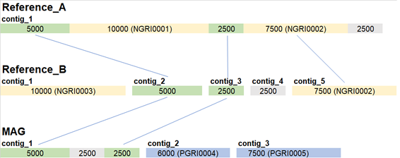

<h1>Genomic Regions of Interest (GRIs)</h1>

Genomic Region of Interest (GRI) is a concept created in this project to define sequence regions of at least 5000 bases (default value) that exists in one genome but not exists in another.
GRIs are divided in two types:
* Positive GRIs: Region found in MAG genome, but not found in any reference genome;
* Negative GRIs: Region not found in MAG genome, but found in one or more reference genomes;

You can use the module MAGcheck to search for negative GRIs in your raw data (the data used to assembly the MAG). If any negative GRIs were found, it may suggest that your assembly process lost parts of the genome, and if you want a more complete MAG, it may be a good idea reassemble it.  
  

**Example of GRIs identification process:**

Example of comparing a MAG with two references. The value within each rectangle represents the size of the region. Green regions are similar regions in all genomes, so they are not GRIs. The yellow regions are negative GRIs (NGRI0001, NGRI0002) and the blue regions are positive GRIs (PRGI0003 and PRGI0004). NRGI0002 was found in two reference genomes, so both regions contain the same identifier code. Gray regions are exclusive, but have been discarded as they did not meet the minimum size requirement.
