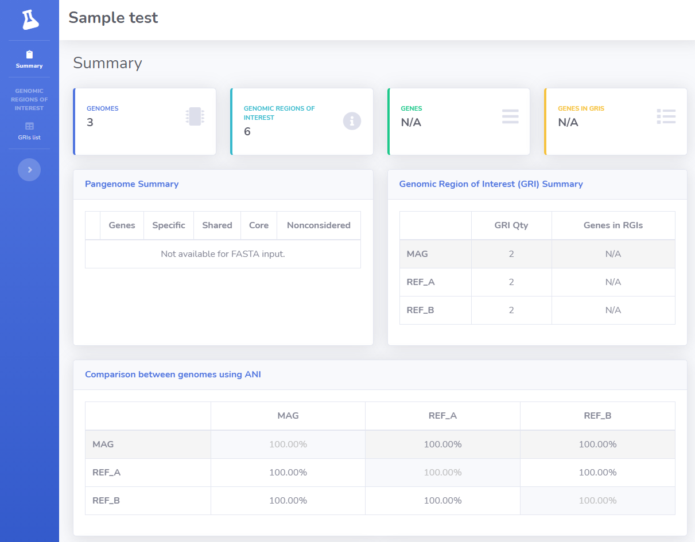

# Quick start - Running MAGset with .fasta input

In this tutorial we will use very small sample genomes to demonstrate how MAGset works. All genomes are fasta files . Some results are generated just if the input are GenBank genome files. After this quick start, please read our tutorial with GenBank files too.

* [Install MAGset](How-to-install.md)
* [Download the test data](test-data-quick-start.tar.gz)  

* Descompact the test data 
`tar -xvzf test-data-quick-start.tar.gz`

* At the conf.properties (available inside the test folder), fix the property "genomes_folder",  using the absolute path where is the test data genomes_folder and fix the property "output_folder", using absolute path too. If your machine supports less than 8 threads (default value), please change the property threads for the correct number of threads.
Example of conf.properties, considering the genomes folder is at /home/fabiosanchez/magset/test/genomes_folder and the output is at /home/fabiosanchez/magset/test/output: 
`title=MAGset test` 
`genomes_folder=/home/fabiosanchez/magset/test/genomes_folder/` 
`output_folder=/home/fabiosanchez/magset/test/output/` 
`num_threads=8` 
`mag_file=MAG.fasta` 
`reference_genome_files=REF_A.fasta,REF_B.fasta`

* Run MAGset script 
To run the script, just execute the main script and inform the path of the conf.properties file as first parameter: 
`./run-magset.sh test/conf.properties`. 

The first run can takes some time, because it is necessary download the docker container. After the script execute, you will see the message "MAGset: done!" at the console. If you receive this message, everything is ok!

Inside the output_folder will be possible see all generated files, including "result" folder, with HTML and CSV results. 
The index.html contains the summary of the results:

* ANI matrix;
 * Comparison between all genomes using ANI; 
* Genomic Region of Interest (GRI) Summary;
 * A central concept in MAGset is the Genomic Region of Interest. Please read the MAGset article for more details.
  

Result screenshot:

 

 

