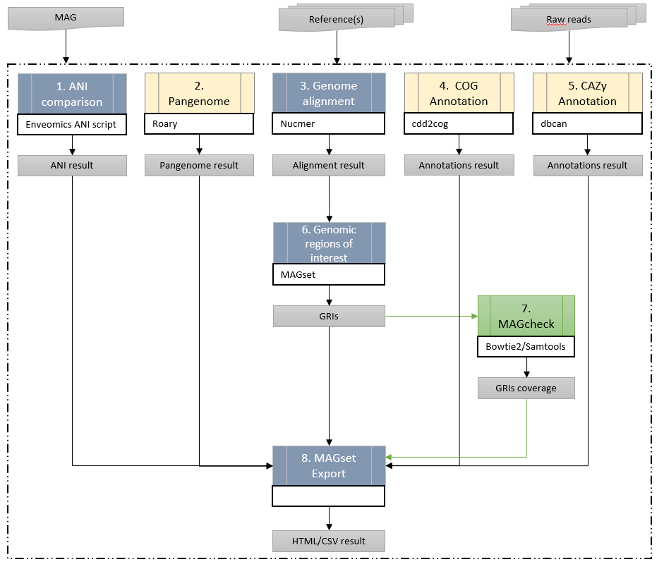
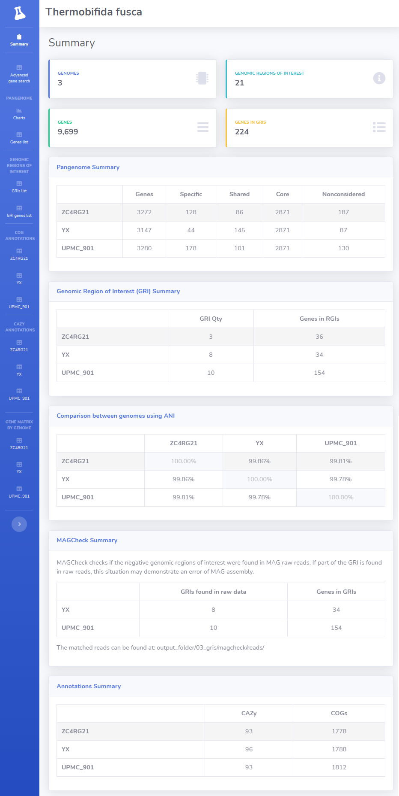

<h1>Welcome to the MAGset wiki!</h1>
MAGset is a tool to analyze genomes obtained from metagenomic data (MAGs) of known species (which have published reference genomes).  

The tool generates the following results:

* ANI matrix between genomes;
* Pangenome (specific, shared and core genes);
* Identification of genomic regions of interest (GRIs);
* COGs and CAZy annotations;
* Advanced search of genes by gene data;
* Validation of MAG assembly using raw data vs references genomes;

All results are generated in HTML.

  
  

Screenshot from a MAGset result:

Please use the links below to learn more about the MAGset: 

* [How to install](How-to-install.md)
* [Quick start](Quick-start.md)
* [Tutorial - GBFF files as input](tutorial-gbff-files-as-input.md)
* [Tutorial - How to use the advanced gene search](tutorial-advanced-gene-search.md)
* [Tutorial - Using MAGcheck](tutorial-using-magcheck.md)
* [Input files](Input-files.md)
* [Output files](Output-files.md)
* [Parameters](Parameters.md)

##Article
Coming soon!