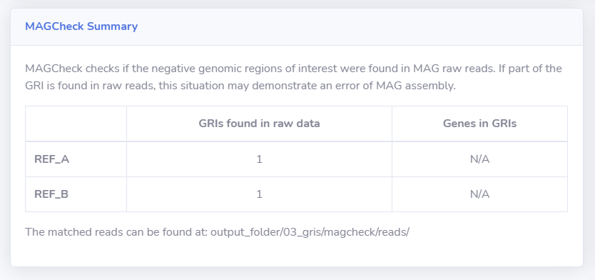
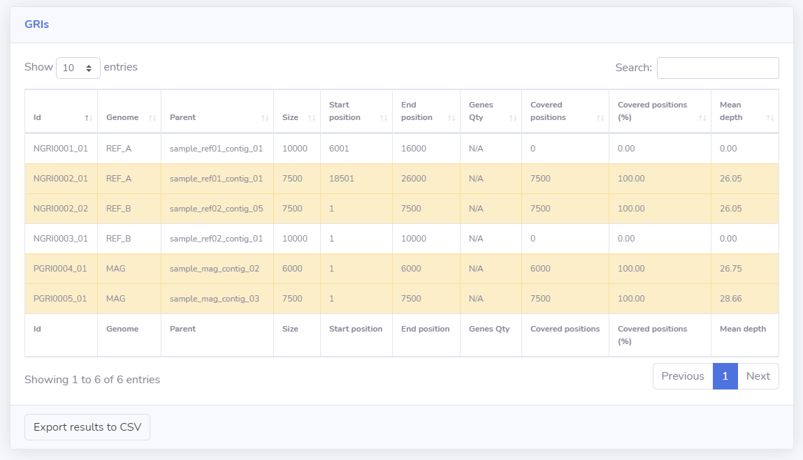

# Tutorial - Running MAGset with MAGcheck

In this tutorial, we will use very small sample genomes and very small raw data to demonstrate how MAGcheck works. MAGcheck allows you to identify negative GRIs (genomic regions of interest) in raw data. Please read the MAGset article for more details. 

* [Install MAGset](How-to-install.md)
* [Download the test data](test-data-magcheck.tar.gz)  

* Descompact the test data 
`tar -xvzf test-data-quick-start.tar.gz`

* At the conf.properties (available inside the test folder), fix the properties "genomes\_folder" (folder where the genome files are saved, provided in the test data) , "output\_folder" (you can choose) and "raw\_reads\_folder" (folder where the raw data file is saved, provided in the test data), using absolute path. If your machine supports less than 8 threads (default value), please change the property threads for the correct number of threads.
Example of conf.properties, considering the genomes folder is at /home/fabiosanchez/magset/test/genomes\_folder, the raw data folder is at /home/fabiosanchez/magset/test/raw\_data and the output is at /home/fabiosanchez/magset/test/output: 
`title=MAGset test` 
`genomes_folder=/home/fabiosanchez/magset/test/genomes_folder/` 
`output_folder=/home/fabiosanchez/magset/test/output/` 
`num_threads=8` 
`mag_file=MAG.fasta` 
`reference_genome_files=REF_A.fasta,REF_B.fasta` 
`raw_reads_folder=/mnt/c/Projetos/Mestrado/magset-export/others/samples/small-fasta/raw-data/` 
`raw_reads_files_unpaired=reads.fastq`
    * This example is using unpaired reads, if you have paired reads please look at [Parameters](Parameters.md) page, properties `raw_reads_files_r1` and `raw_reads_files_r2`.

* Run MAGset script 
To run the script, just execute the main script and inform the path of the conf.properties file as first parameter: 
`./run-magset.sh test/conf.properties`. 

The first run can takes some time, because it is necessary download the docker container. After the script execute, you will see the message "MAGset: done!" at the console. If you receive this message, everything is ok!

Inside the output_folder will be possible see all generated files, including "result" folder, with HTML and CSV results. 
The index.html contains the summary of the results. The difference of this execution and the quick start is the MAGcheck panel:

The MAGcheck summary panel shows the negative GRIs found in the raw data. If part of the GRI is found in raw reads, this may indicate that the MAG assembler was unable to correctly assemble the genome, losing some parts.
 

The "GRIs list" page shows the GRIs found in the raw data with yellow background:

 

